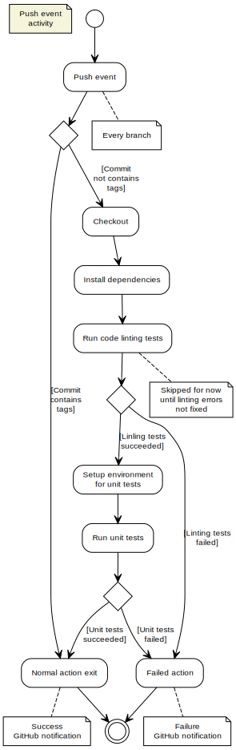
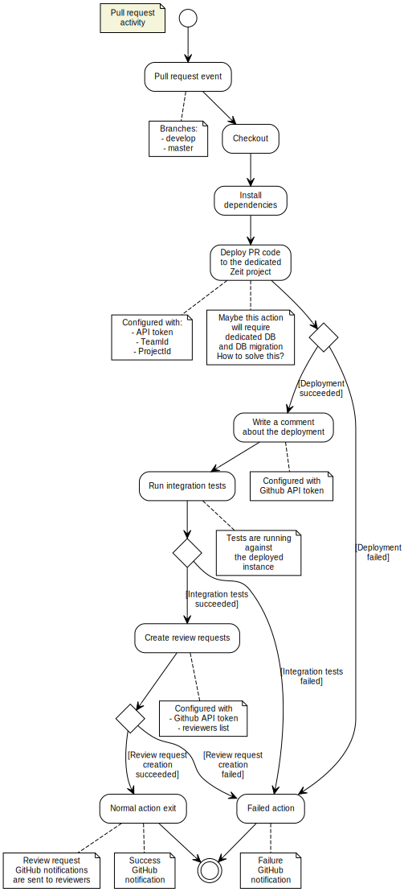
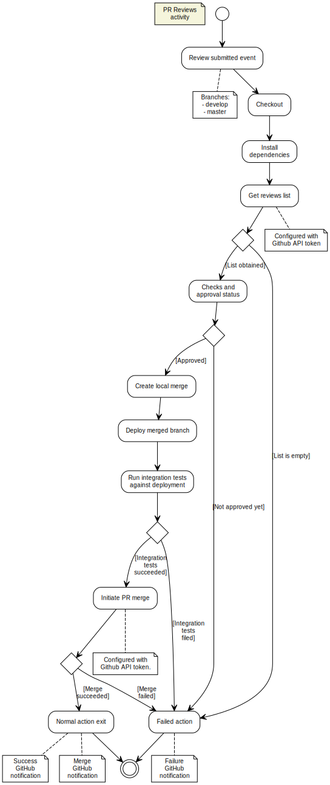

# The Glider aggregator CI/CD

CI/CD framework for the Glider aggreagator is based on the [GitHub actions](https://github.com/features/actions) features.

## Repository Events

- **push** 
- **pull_request** (and also PR **synchronize**)*
- **pull_request_review**
- scheduler events

(*) note: Workflow configuration should include `PULL_REVIEWERS` configuration (semicolon-separated list of usernames) that can be the only chosen from the collaborators

## GitHub Actions Secrets

These [secrets have to be defined](https://github.com/windingtree/glider-aggregator/settings/secrets) in the repository environment:

- `NOW_TOKEN`: [Zeit Now API token](https://zeit.co/account/tokens)
- `NOW_PROJECT_ID`: can be obtained from the `./now/project.json`
- `NOW_ORG_ID`: can be obtained from the `./now/project.json`
- `GH_TOKEN_EXT`: [GitHub API token](https://github.com/settings/tokens) with following access rights: notifications, read:packages, repo, user, workflow, write:discussion, write:packages

## CI/CD Acitivity Diagramms

**push** events handling is managed by the [unit.yml](./.github/../../.github/workflows/unit.yml) workflow

**pull_request** events handling is managed by the [integration.yml](./.github/../../.github/workflows/integration.yml) workflow 

**pull_request_review** events handling is managed by the [reviews.yml](./.github/../../.github/workflows/reviews.yml) workflow 

